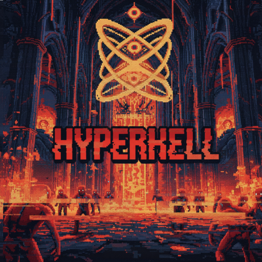

# HYPERHELL

Welcome to HYPERHELL, the first 4-Dimensional DOOM-Like of its kind.

[Play the Demo Online](https://dugas.ch/hyperhell)

Note: This demo requires WebGPU compatible hardware+browser (I've successfully tested it on Macbook M1, M2, and Nvidia GPUs + Chrome)

## About

Our feeble human minds can only comprehend up to 3 dimensions, so prepare to be disoriented as you descend into the 4-dimensional maze of HYPERHELL, and carve your way out through hordes of lost souls, demons and dark angels, to survive.

In this demo level, you will meet the Bargainer, who offers you an exchange that may be your only way out. Alter yourself to transcend the 3 dimensions you are bound to, or resign yourself to your fate. Your choice.

## Why HYPERHELL

This game started as a question: can we understand 4-dimensional worlds intuitively?

After some experimentation with rendering techniques for 4D worlds, I explored a new way to render 4D: through a 4D Eye, i.e. a camera with a 3D sensor.

Because I think we learn best by interacting, I then settled on creating a game that would use this new sensor rendering (which became the "Unblink" mechanic).

## Gameplay

[Full Gameplay Video (Spoilers)](https://www.youtube.com/watch?v=5iG1ujk_H5Y)

## Dev Log

[Dev Log #1: Simulating a 4D Eye](https://www.youtube.com/watch?v=tKDMcLW9OnI)
